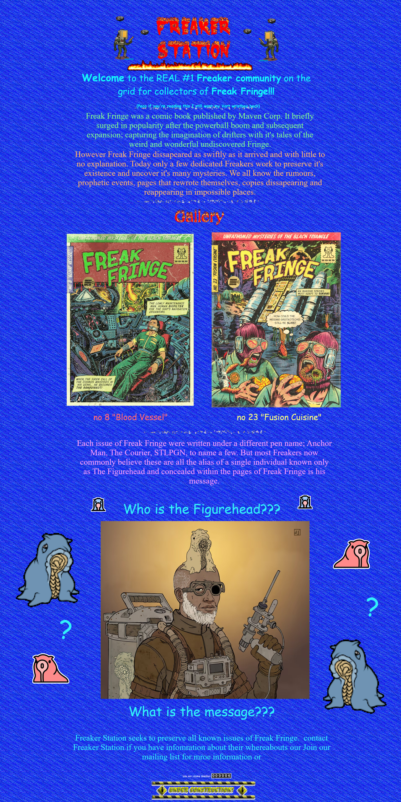

# Freak Fringe Comic Reader

A modern digital comic reader web application built with React and TypeScript, featuring a clean gallery interface, full-screen viewing experience, and comprehensive accessibility support. Optimized for performance with responsive images, keyboard navigation, and seamless deployment on Cloudflare Workers.

## Retro Theme Preview



The interface adopts a playful late-90s web aesthetic with neon accents, pixel art flourishes, and CRT-inspired glow effects. The gallery and reader are styled with Tailwind CSS utilities for consistent spacing, contrast, and motion.

## Features

• **Gallery Grid View**: Responsive thumbnail grid with hover effects and smooth transitions  
• **Full-Screen Viewer**: Distraction-free reading experience with click-to-navigate zones  
• **Keyboard Navigation**: Navigate with arrow keys (←/→) and ESC to return to gallery  
• **Responsive Images**: Automatic 1x/2x srcset support for all device pixel densities  
• **Performance Optimized**: 
  - Lazy loading for gallery thumbnails
  - Preloading of adjacent comic pages for smooth navigation
  - Layout shift prevention with explicit image dimensions
  - Optimized asset bundling with Vite
• **Accessibility First**:
  - Full keyboard navigation support
  - Comprehensive alt text generated from comic metadata
  - Semantic HTML structure with proper heading hierarchy
  - High contrast focus indicators and ARIA labels
• **Cloudflare Workers Integration**: Optimized for edge computing and global CDN delivery
• **Automatic Thumbnail Generation**: Build-time thumbnail creation from source images

## Tech Stack

• **React 19**: Latest React with concurrent features and improved performance  
• **TypeScript 5**: Full type safety with latest TypeScript features  
• **Vite 7**: Lightning-fast build tool with HMR and optimized bundling  
• **TailwindCSS 4**: Utility-first CSS framework with custom design system  
• **Cloudflare Workers/Pages**: Edge computing and global CDN deployment  
• **Sharp**: High-performance image processing for thumbnail generation  
• **React Router DOM 7**: Client-side routing with gallery and viewer pages  
• **ESLint + TypeScript ESLint**: Code linting with TypeScript rules  
• **Prettier**: Code formatting (configured via ESLint integration)

## Project Structure

```
freak-fringe/
├── public/
│   ├── comics/              # Source comic images (JPG/PNG)
│   │   ├── freak-fringe.jpg
│   │   └── fringe-far-out.jpg
│   ├── thumbs/              # Auto-generated thumbnails
│   │   ├── freak-fringe.jpg      # 400px width
│   │   ├── freak-fringe@2x.jpg   # 800px width
│   │   ├── fringe-far-out.jpg
│   │   └── fringe-far-out@2x.jpg
│   └── fonts/               # Custom typefaces
│       ├── FringeV2.otf          # Display font
│       └── GT-Pressura-Mono-Light.otf
├── src/
│   ├── App.tsx              # Main router and layout
│   ├── Gallery.tsx          # Thumbnail grid component
│   ├── Header.tsx           # Navigation header
│   ├── Viewer.tsx           # Full-screen comic reader
│   ├── data/
│   │   └── comics.ts        # Comic metadata and TypeScript interfaces
│   ├── utils/
│   │   └── imageUtils.ts    # Image path helpers and srcset generation
│   ├── fonts.css            # Custom font definitions
│   ├── globals.css          # Global styles and CSS variables
│   ├── index.css            # Tailwind imports
│   ├── root.css             # Root-level styles
│   └── main.tsx             # Application entry point
├── scripts/
│   └── gen-thumbs.mjs       # Node.js thumbnail generation script
├── worker/
│   └── index.ts             # Cloudflare Worker for local development
├── eslint.config.js         # ESLint configuration
├── tailwind.config.ts       # Tailwind CSS configuration
├── tsconfig.json            # TypeScript configuration
├── vite.config.ts           # Vite build configuration
├── wrangler.toml            # Cloudflare Worker configuration
```

## Available npm Scripts

| Script | Description |
|--------|-------------|
| `npm run dev` | Start the development server with Vite and Cloudflare integration |
| `npm run build` | Production build: generate thumbnails → compile TypeScript → build with Vite |
| `npm run deploy` | Deploy the application to Cloudflare |
| `npm run gen:thumbs` | Generate 1x and 2x resolution thumbnails from source images |
| `npm run lint` | Run ESLint code analysis across all TypeScript and JavaScript files |
| `npm run preview` | Preview the production build remotely using Cloudflare's tunnel |

## Development Setup

### Prerequisites
- **Node.js 18+** (LTS recommended)
- **npm** (comes with Node.js)

### Step-by-Step Installation

1. **Clone the repository**:
   ```bash
   git clone [repository-url]
   cd freak-fringe
   ```

2. **Install dependencies**:
   ```bash
   npm install
   ```
   This installs all production and development dependencies including React 19, TypeScript 5, Vite 7, and TailwindCSS 4.

3. **Start the development server**:
   ```bash
   npm run dev
   ```
   This command starts the Vite development server, which is integrated with the Cloudflare worker for a seamless experience.

4. **Open in your browser**:
   - **Development**: http://localhost:5173

5. **Verify setup**: You should see the comic gallery with existing demo comics ("Freak Fringe" and "Far Out")

### Development Workflow

1. **Add new comics**: Place image files in `public/comics/` directory
2. **Update comic metadata**: Edit `src/data/comics.ts` with new comic information
3. **Generate thumbnails**: Run `npm run gen:thumbs` (automatically runs during build)
4. **Test changes**: Development server provides hot module replacement for instant updates

## Asset Management Workflow

### Comic Images
- **Location**: `public/comics/`
- **Supported formats**: JPG, PNG, WebP, GIF, TIFF, SVG
- **Naming convention**: Use descriptive kebab-case filenames (e.g., `freak-fringe.jpg`)
- **Size recommendations**: Optimize for web delivery (ideally under 2MB per image)
- **Dimensions**: Comic images should maintain consistent aspect ratios for best gallery display

### Thumbnail Generation with `scripts/gen-thumbs.mjs`

The thumbnail generation script uses Sharp for high-performance image processing:

**How it works**:
1. **Scans** `public/comics/` directory for supported image formats
2. **Processes** each image through Sharp with optimized settings
3. **Generates** two versions:
   - Standard resolution: 400px width (maintains aspect ratio)
   - High-DPI version: 800px width with `@2x` suffix
4. **Outputs** to `public/thumbs/` directory

**Script features**:
- Recursive directory processing for organized comic collections
- Automatic format detection and conversion
- Error handling with detailed console output
- Preserves original image quality while optimizing file size

**Manual usage**:
```bash
npm run gen:thumbs
```

**Build integration**: Thumbnails are automatically generated during `npm run build`

### Adding New Comics

1. **Add image file** to `public/comics/`
2. **Update comic data** in `src/data/comics.ts`:
   ```typescript
   {
     id: 3,
     title: 'New Comic Title',
     thumb: '/thumbs/new-comic.jpg',
     thumb2x: '/thumbs/new-comic@2x.jpg',
     full: '/comics/new-comic.jpg',
     full2x: '/comics/new-comic.jpg',
     description: 'Accessibility-friendly description',
     width: 2325,
     height: 3150
   }
   ```
3. **Generate thumbnails**: `npm run gen:thumbs`
4. **Test in browser**: Development server will hot-reload with new content

## Accessibility Notes

The app is built with accessibility-first principles:

- Keyboard: Full keyboard support across gallery and viewer (Tab, Shift+Tab, Enter/Space on buttons, Arrow Left/Right to navigate pages, and Esc to return from viewer).
- Semantics: Semantic HTML (section, figure/figcaption, headings) and ARIA labels for interactive elements (e.g., the news marquee region includes aria-label and role).
- Alt text: Descriptive alt text generated from comic metadata for both thumbnails and full images.
- Focus visibility: High-contrast focus rings and clear interaction states; buttons/links maintain visible focus.
- Motion: Hover/transition effects are subtle; consider enabling reduced motion system settings. The marquee is implemented as a non-essential enhancement and is labeled for assistive tech.
- Color contrast: Neon accents are paired with dark backgrounds; text colors are chosen to meet WCAG AA in primary flows.

If you encounter any accessibility issues or have suggestions, please open an issue.

## Deployment

**Quick Cloudflare Deployment**:
1. Configure your `wrangler.toml` file with your account details
2. Run `npm run build` to create the production bundle
3. Run `npm run deploy` to publish the application to Cloudflare
4. Enjoy global edge deployment with built-in CDN distribution

The application includes built-in optimizations for Cloudflare Workers including responsive images, proper caching headers, and accessibility enhancements.

## License / Credits

- **Custom Fonts**: 
  - FringeV2: Display typeface for headers and branding
  - GT-Pressura-Mono-Light: Monospace font for technical elements
- **Built with**: Modern React and TypeScript web application
- **Styled with**: Tailwind CSS utility framework
- **Optimized for**: Cloudflare Workers global deployment
